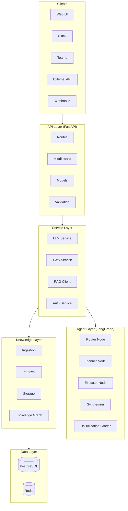
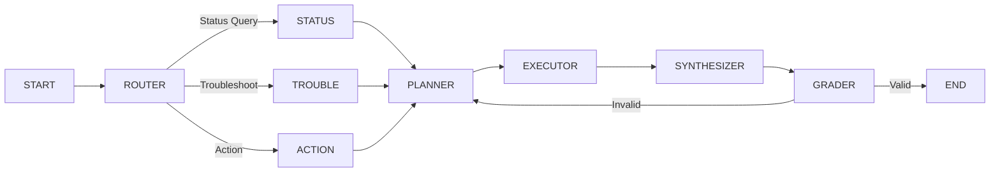
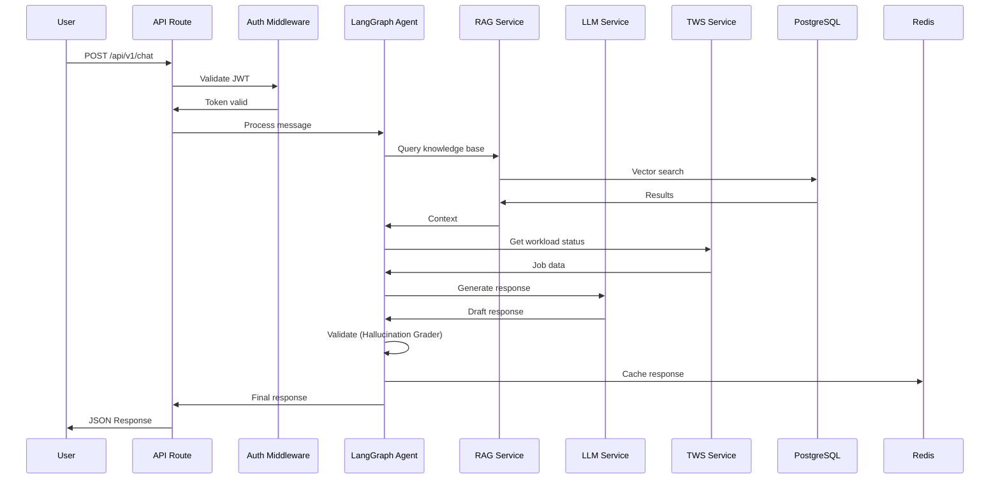
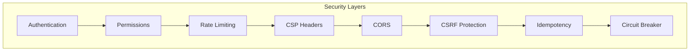

# Resync Project - Complete Documentation

## Overview

**Resync** is a comprehensive AI Agent Orchestration Platform built with FastAPI, LangGraph, and RAG (Retrieval Augmented Generation). The system is specifically designed to integrate with IBM Tivoli Workload Scheduler (TWS), providing intelligent workload automation and scheduling capabilities through AI-powered agents.

**Version:** 6.2.0  
**Tech Stack:** Python 3.10+, FastAPI, LangGraph, PostgreSQL (with pgvector), Redis

---

## Project Architecture

The Resync project follows a layered architecture pattern:



---

## Directory Structure

```
resync/
├── main.py                 # ASGI entry point
├── app_factory.py         # FastAPI application factory
├── settings.py            # Pydantic-based configuration
├── settings_types.py      # Custom types for settings
├── settings_validators.py  # Settings validators
├── csp_validation.py      # CSP validation utilities
│
├── api/                   # REST API layer
│   ├── routes/            # Endpoint definitions
│   │   ├── admin/         # Administrative endpoints
│   │   ├── agents/        # Agent execution endpoints
│   │   ├── core/          # Core endpoints (auth, chat, health)
│   │   ├── monitoring/    # Monitoring and metrics
│   │   ├── rag/           # RAG operations
│   │   ├── knowledge/     # Knowledge ingestion
│   │   └── enterprise/    # Enterprise features
│   ├── middleware/       # HTTP middleware
│   ├── models/           # Pydantic models
│   ├── validation/        # Request validation
│   ├── auth/             # Authentication module
│   ├── security/         # Security utilities
│   ├── services/         # API services
│   └── utils/             # Utility functions
│
├── core/                  # Core business logic
│   ├── langgraph/        # LangGraph agent implementations
│   ├── cache/            # Multi-layer caching system
│   ├── database/        # SQLAlchemy models and repositories
│   ├── health/          # Health check system
│   ├── idempotency/     # Idempotency control
│   ├── monitoring/      # Monitoring components
│   ├── security/        # Security utilities
│   ├── utils/           # Core utilities
│   └── tws/             # TWS-specific implementations
│
├── services/             # Business services
│   ├── llm_service.py   # LLM abstraction (OpenAI, Anthropic, LiteLLM)
│   ├── rag_client.py    # RAG client
│   ├── tws_service.py   # IBM TWS integration
│   └── ...
│
├── knowledge/            # Knowledge management
│   ├── ingestion/       # Document ingestion pipeline
│   ├── retrieval/       # Retrieval systems
│   ├── store/           # Vector storage (PgVector)
│   ├── kg_store/        # Knowledge graph storage
│   └── kg_extraction/   # KG extraction from documents
│
├── models/              # Domain models
├── workflows/           # ML workflows
├── config/              # Configuration files
├── scripts/             # Setup and utility scripts
└── tests/              # Test suite
```

---

## Key Modules and Their Functions

### 1. Entry Points

| File | Function |
|------|----------|
| [`resync/main.py`](resync/main.py) | ASGI entry point - creates the FastAPI application |
| [`resync/app_factory.py`](resync/app_factory.py) | Factory pattern for application creation with middleware setup |
| [`resync/settings.py`](resync/settings.py) | Centralized Pydantic-based configuration management |

### 2. API Layer (`resync/api/`)

The API layer handles all HTTP requests and responses.

#### Routes (`resync/api/routes/`)

| Module | Purpose |
|--------|---------|
| [`resync/api/routes/admin/`](resync/api/routes/admin/) | Administrative endpoints (users, settings, backups, stats) |
| [`resync/api/routes/agents/`](resync/api/routes/agents/) | AI agent execution and management |
| [`resync/api/routes/core/`](resync/api/routes/core/) | Core endpoints: authentication, chat, health checks |
| [`resync/api/routes/monitoring/`](resync/api/routes/monitoring/) | Metrics, dashboards, observability |
| [`resync/api/routes/rag/`](resync/api/routes/rag/) | RAG query and document upload endpoints |
| [`resync/api/routes/knowledge/`](resync/api/routes/knowledge/) | Knowledge ingestion API |
| [`resync/api/routes/enterprise/`](resync/api/routes/enterprise/) | Enterprise features and API gateway |

#### Middleware (`resync/api/middleware/`)

| Middleware | Function |
|------------|----------|
| [`resync/api/middleware/cors_middleware.py`](resync/api/middleware/cors_middleware.py) | Cross-Origin Resource Sharing handling |
| [`resync/api/middleware/csp_middleware.py`](resync/api/middleware/csp_middleware.py) | Content Security Policy enforcement |
| [`resync/api/middleware/csrf_protection.py`](resync/api/middleware/csrf_protection.py) | CSRF attack protection |
| [`resync/api/middleware/security_headers.py`](resync/api/middleware/security_headers.py) | Security HTTP headers |
| [`resync/api/middleware/rate_limiting.py`](resync/api/middleware/rate_limiting.py) | Request rate limiting |
| [`resync/api/middleware/idempotency.py`](resync/api/middleware/idempotency.py) | Idempotent request handling |
| [`resync/api/middleware/error_handler.py`](resync/api/middleware/error_handler.py) | Centralized error handling |
| [`resync/api/middleware/correlation_id.py`](resync/api/middleware/correlation_id.py) | Request tracing with correlation IDs |
| [`resync/api/middleware/compression.py`](resync/api/middleware/compression.py) | Response compression |

#### Models (`resync/api/models/`)

| Model | Purpose |
|-------|---------|
| [`resync/api/models/auth.py`](resync/api/models/auth.py) | Authentication data models |
| [`resync/api/models/requests.py`](resync/api/models/requests.py) | Request body schemas |
| [`resync/api/models/responses.py`](resync/api/models/responses.py) | Response schemas |
| [`resync/api/models/agents.py`](resync/api/models/agents.py) | Agent-related models |
| [`resync/api/models/rag.py`](resync/api/models/rag.py) | RAG operation models |

---

### 3. Core Layer (`resync/core/`)

The core layer contains the main business logic and infrastructure.

#### LangGraph Agents (`resync/core/langgraph/`)

The heart of the AI agent system - implements agent orchestration using LangGraph:



| Component | File | Description |
|-----------|------|-------------|
| Agent Graph | [`resync/core/langgraph/agent_graph.py`](resync/core/langgraph/agent_graph.py) | Main agent flow definition |
| Nodes | [`resync/core/langgraph/nodes.py`](resync/core/langgraph/nodes.py) | Individual node implementations |
| Checkpointer | [`resync/core/langgraph/checkpointer.py`](resync/core/langgraph/checkpointer.py) | State persistence with PostgreSQL |
| Subgraphs | [`resync/core/langgraph/subgraphs.py`](resync/core/langgraph/subgraphs.py) | Diagnostic and parallel subgraphs |
| ROMA System | [`resync/core/langgraph/roma_graph.py`](resync/core/langgraph/roma_graph.py) | Multi-agent ROMA system |
| Hallucination Grader | [`resync/core/langgraph/hallucination_grader.py`](resync/core/langgraph/hallucination_grader.py) | Response validation |

#### Cache System (`resync/core/cache/`)

Multi-layer caching architecture for performance optimization:

| Layer | Technology | Purpose |
|-------|------------|---------|
| L1 | In-Memory (functools) | Fast access, LRU cache |
| L2 | Redis | Distributed cache, sessions, rate limiting |
| L3 | PostgreSQL | Persistent cache, audit logs |

Key files:
- [`resync/core/cache/advanced_cache.py`](resync/core/cache/advanced_cache.py) - Multi-layer cache implementation
- [`resync/core/cache/semantic_cache.py`](resync/core/cache/semantic_cache.py) - Semantic (embedding-based) caching
- [`resync/core/cache/cache_hierarchy.py`](resync/core/cache/cache_hierarchy.py) - Cache hierarchy management

#### Database (`resync/core/database/`)

SQLAlchemy-based data persistence:

| Component | File | Description |
|-----------|------|-------------|
| Engine | [`resync/core/database/engine.py`](resync/core/database/engine.py) | Database engine configuration |
| Session | [`resync/core/database/session.py`](resync/core/database/session.py) | Session management |
| Models | [`resync/core/database/models/`](resync/core/database/models/) | SQLAlchemy ORM models |

**Main Tables:**
- `users` - User accounts and profiles
- `audit_logs` - Security audit trail
- `tws_*` - IBM TWS related data (snapshots, job status, events)
- `kg_nodes`, `kg_edges` - Knowledge graph data
- `conversations` - Chat history
- `workstation_metrics_history` - Performance metrics

#### Health System (`resync/core/health/`)

Comprehensive health checking system:

| Component | Description |
|-----------|-------------|
| [`resync/core/health/unified_health_service.py`](resync/core/health/unified_health_service.py) | Unified health check service |
| [`resync/core/health/proactive_monitor.py`](resync/core/health/proactive_monitor.py) | Proactive monitoring |
| [`resync/core/health/circuit_breaker_manager.py`](resync/core/health/circuit_breaker_manager.py) | Circuit breaker pattern |

---

### 4. Services Layer (`resync/services/`)

Business logic services that abstract external systems:

| Service | File | Description |
|---------|------|-------------|
| LLM Service | [`resync/services/llm_service.py`](resync/services/llm_service.py) | Unified interface for OpenAI, Anthropic, LiteLLM |
| RAG Client | [`resync/services/rag_client.py`](resync/services/rag_client.py) | RAG operations abstraction |
| TWS Service | [`resync/services/tws_service.py`](resync/services/tws_service.py) | IBM TWS API integration |

---

### 5. Knowledge Layer (`resync/knowledge/`)

RAG (Retrieval Augmented Generation) infrastructure:

#### Ingestion Pipeline (`resync/knowledge/ingestion/`)

| Component | Description |
|-----------|-------------|
| [`resync/knowledge/ingestion/pipeline.py`](resync/knowledge/ingestion/pipeline.py) | Complete ingestion workflow |
| [`resync/knowledge/ingestion/document_converter.py`](resync/knowledge/ingestion/document_converter.py) | Document parsing (PDF, MD, etc) |
| [`resync/knowledge/ingestion/chunking.py`](resync/knowledge/ingestion/chunking.py) | Text chunking strategies |
| [`resync/knowledge/ingestion/embedding_service.py`](resync/knowledge/ingestion/embedding_service.py) | Embedding generation |

#### Retrieval (`resync/knowledge/retrieval/`)

| Component | Description |
|-----------|-------------|
| [`resync/knowledge/retrieval/retriever.py`](resync/knowledge/retrieval/retriever.py) | Base retriever |
| [`resync/knowledge/retrieval/hybrid_retriever.py`](resync/knowledge/retrieval/hybrid_retriever.py) | Hybrid search (keyword + semantic) |
| [`resync/knowledge/retrieval/reranker.py`](resync/knowledge/retrieval/reranker.py) | Result re-ranking |
| [`resync/knowledge/retrieval/graph.py`](resync/knowledge/retrieval/graph.py) | Graph-based retrieval |

#### Storage (`resync/knowledge/store/`)

| Store | Description |
|-------|-------------|
| [`resync/knowledge/store/pgvector.py`](resync/knowledge/store/pgvector.py) | PgVector vector database |
| [`resync/knowledge/kg_store/store.py`](resync/knowledge/kg_store/store.py) | Knowledge graph storage |

---

### 6. Configuration (`resync/config/`)

Security and application configuration:

| File | Purpose |
|------|---------|
| [`resync/config/security.py`](resync/config/security.py) | Security settings |
| [`resync/config/enhanced_security.py`](resync/config/enhanced_security.py) | Enhanced security features |
| [`resync/config/slo.py`](resync/config/slo.py) | Service Level Objectives |

---

## Data Flow

### Chat Request Flow



---

## Security Architecture

The system implements multiple security layers:



**Authentication Methods:**
- JWT (Bearer tokens)
- OAuth2 (External providers)
- API Keys (Admin access)

**Protection Mechanisms:**
- Rate limiting (per-user, per-endpoint)
- CORS configuration
- CSRF tokens
- Content Security Policy
- Circuit breaker pattern

---

## External Integrations

| System | Purpose | Integration File |
|--------|---------|------------------|
| IBM TWS | Workload scheduling | [`resync/services/tws_service.py`](resync/services/tws_service.py) |
| OpenAI | GPT models | [`resync/services/llm_service.py`](resync/services/llm_service.py) |
| Anthropic | Claude models | [`resync/services/llm_service.py`](resync/services/llm_service.py) |
| Langfuse | LLM observability | [`resync/core/langfuse/`](resync/core/langfuse/) |
| PostgreSQL | Primary database | [`resync/core/database/`](resync/core/database/) |
| Redis | Cache/Sessions | [`resync/core/cache/`](resync/core/cache/) |

---

## Key Endpoints

| Method | Endpoint | Description |
|--------|----------|-------------|
| POST | `/api/v1/chat` | Chat with AI agent |
| POST | `/api/v1/agents/execute` | Execute agent |
| POST | `/api/v1/rag/query` | RAG query |
| POST | `/api/v1/rag/upload` | Upload document |
| GET | `/api/v1/health` | Health check |
| POST | `/api/v1/auth/login` | Authentication |
| GET | `/api/v1/admin/stats` | Admin statistics |
| GET | `/api/v1/monitoring/metrics` | System metrics |

---

## Dependencies

Key Python dependencies (from [`requirements.txt`](requirements.txt)):

| Package | Purpose |
|---------|---------|
| fastapi | Web framework |
| langgraph | Agent orchestration |
| langchain | LLM utilities |
| sqlalchemy | ORM |
| asyncpg | PostgreSQL async driver |
| redis | Redis client |
| pydantic | Data validation |
| python-jose | JWT handling |
| openai | OpenAI API client |
| anthropic | Anthropic API client |

---

## Development and Deployment

### Running Locally

```bash
# Development server
python -m resync.main

# Or with uvicorn directly
uvicorn resync.main:app --reload
```

### Configuration

Configuration is managed through:
1. Environment variables (with `APP_` prefix)
2. `.env` file
3. Pydantic settings defaults

Key settings in [`resync/settings.py`](resync/settings.py):
- Database connection (PostgreSQL)
- Redis connection
- Authentication secrets
- LLM API keys
- TWS connection details

---

## Summary

Resync is a comprehensive AI orchestration platform that:

1. **Provides AI-powered automation** through LangGraph-based agents
2. **Integrates with IBM TWS** for workload scheduling intelligence
3. **Implements RAG** for contextual knowledge retrieval
4. **Offers enterprise-grade security** with多层 protection
5. **Supports high availability** through caching, circuit breakers, and health checks
6. **Enables observability** with metrics, logging, and tracing

The modular architecture allows each component to be developed, tested, and scaled independently while maintaining clean integration points through well-defined interfaces.
