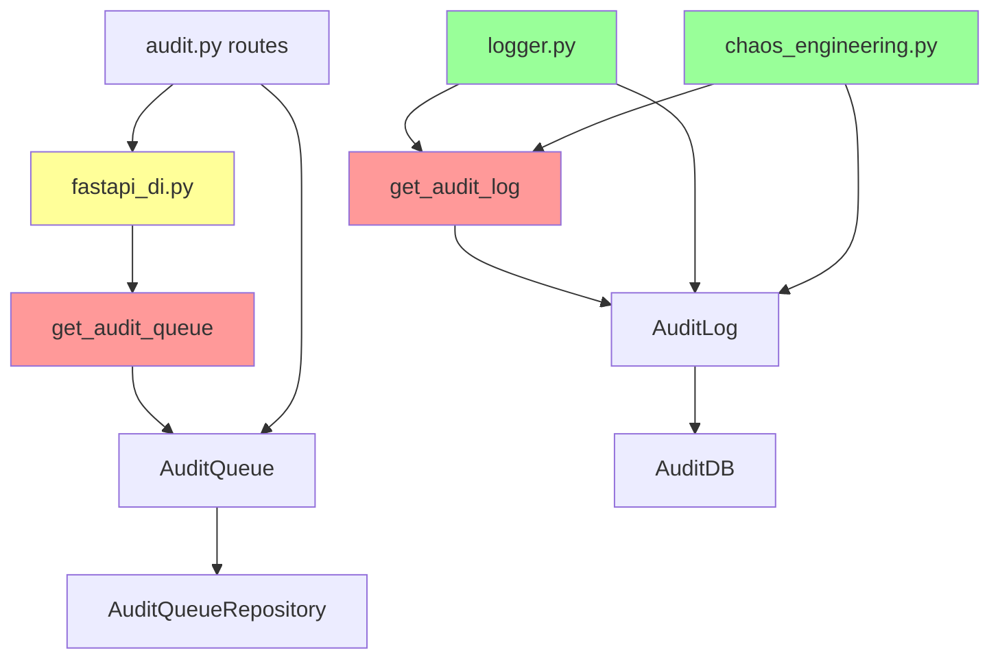

# Plan: Update Callers of get_audit_log() and get_audit_queue() to Use Await

## Executive Summary

This plan addresses the need to convert `get_audit_log()` and `get_audit_queue()` functions from synchronous to asynchronous, and update all callers accordingly. The analysis reveals several critical issues including missing method implementations and interface mismatches.

## Current State Analysis

### Function Definitions (Currently Synchronous)

| Function | Location | Return Type | Notes |
|----------|----------|-------------|-------|
| [`get_audit_log()`](resync/core/audit_log.py:64) | resync/core/audit_log.py:64-69 | `AuditLog` | Singleton accessor |
| [`get_audit_queue()`](resync/core/audit_queue.py:96) | resync/core/audit_queue.py:96-101 | `AuditQueue` | Singleton accessor |
| [`get_audit_queue()`](resync/core/fastapi_di.py:107) | resync/core/fastapi_di.py:107-112 | `AuditQueue` | Wrapper for DI |

### Identified Callers

#### get_audit_log() / get_audit_log_manager() Callers

| File | Lines | Context | Calling Method |
|------|-------|---------|----------------|
| resync/core/logger.py | 151-161 | `log_audit_event()` sync function | `log_audit_event()` (does not exist!) |
| resync/core/chaos_engineering.py | 363-371 | `_audit_db_failure_injection()` async | `get_audit_metrics()` (does not exist!) |
| resync/core/chaos_engineering.py | 554-556 | `_component_isolation_testing()` async | `get_audit_metrics()` (does not exist!) |

#### get_audit_queue() Callers

| File | Lines | Context | Notes |
|------|-------|---------|-------|
| resync/core/fastapi_di.py | 110-111 | Re-export | Wraps original function |
| resync/api/routes/audit.py | 49-50 | FastAPI DI | `audit_queue_dependency = Depends(get_audit_queue)` |

### Critical Issues Found

#### P0-01: Missing Methods on AuditLog Class
The code calls methods that do not exist:
- [`logger.py:154`](resync/core/logger.py:154) calls `audit_manager.log_audit_event()` - **method does not exist**
- [`chaos_engineering.py:365`](resync/core/chaos_engineering.py:365) calls `audit_manager.get_audit_metrics()` - **method does not exist**

The `AuditLog` class only has:
- `initialize()`, `close()`, `log()`, `log_action()`, `get_recent()`, `search()`

#### P0-02: Missing Methods on AuditQueue Class  
The `IAuditQueue` interface defines `get_audit_metrics()` and `get_audit_metrics_sync()` at lines 258-263, but the `AuditQueue` class does not implement them.

## Implementation Plan

### Phase 1: Add Missing Methods

#### Step 1.1: Add get_audit_metrics() to AuditLog class
**File:** [`resync/core/audit_log.py`](resync/core/audit_log.py)

```python
async def get_audit_metrics(self) -> dict[str, Any]:
    """Get audit metrics for monitoring."""
    total_records = await self._db.get_record_count_async()
    return {
        "total_records": total_records,
        "initialized": self._initialized,
    }
```

#### Step 1.2: Add log_audit_event() to AuditLog class
**File:** [`resync/core/audit_log.py`](resync/core/audit_log.py)

```python
async def log_audit_event(
    self,
    action: str,
    user_id: str,
    details: dict[str, Any],
    correlation_id: str | None = None,
    source_component: str = "main",
    severity: str = "INFO",
) -> AuditEntry:
    """Log an audit event with structured details."""
    return await self.log_action(
        action=action,
        user_id=user_id,
        metadata={
            "details": details,
            "correlation_id": correlation_id,
            "source_component": source_component,
            "severity": severity,
        },
    )
```

#### Step 1.3: Add get_audit_metrics() to AuditQueue class
**File:** [`resync/core/audit_queue.py`](resync/core/audit_queue.py)

```python
async def get_audit_metrics(self) -> dict[str, Any]:
    """Get audit queue metrics."""
    pending = await self.get_queue_length()
    return {
        "pending": pending,
        "initialized": self._initialized,
    }

def get_audit_metrics_sync(self) -> dict[str, Any]:
    """Synchronous wrapper for get_audit_metrics."""
    import asyncio
    try:
        loop = asyncio.get_running_loop()
    except RuntimeError:
        from resync.core.utils.async_bridge import run_sync
        return run_sync(self.get_audit_metrics())
    raise RuntimeError(
        "get_audit_metrics_sync() cannot be used inside an active "
        "event loop; use await get_audit_metrics() instead"
    )
```

### Phase 2: Make Singleton Accessors Async

#### Step 2.1: Convert get_audit_log() to async
**File:** [`resync/core/audit_log.py`](resync/core/audit_log.py)

Change from:
```python
def get_audit_log() -> AuditLog:
    """Get the singleton AuditLog instance."""
    global _instance
    if _instance is None:
        _instance = AuditLog()
    return _instance
```

To:
```python
async def get_audit_log() -> AuditLog:
    """Get the singleton AuditLog instance, initializing if needed."""
    global _instance
    if _instance is None:
        _instance = AuditLog()
        await _instance.initialize()
    return _instance
```

#### Step 2.2: Convert get_audit_queue() to async
**File:** [`resync/core/audit_queue.py`](resync/core/audit_queue.py)

Change from:
```python
def get_audit_queue() -> AuditQueue:
    """Get the singleton AuditQueue instance."""
    global _instance
    if _instance is None:
        _instance = AuditQueue()
    return _instance
```

To:
```python
async def get_audit_queue() -> AuditQueue:
    """Get the singleton AuditQueue instance, initializing if needed."""
    global _instance
    if _instance is None:
        _instance = AuditQueue()
        _instance.initialize()
    return _instance
```

### Phase 3: Update FastAPI DI Wrapper

#### Step 3.1: Update get_audit_queue() in fastapi_di.py
**File:** [`resync/core/fastapi_di.py`](resync/core/fastapi_di.py)

Change from:
```python
def get_audit_queue():
    """Return the AuditQueue singleton."""
    from resync.core.audit_queue import get_audit_queue as _get
    return _get()
```

To:
```python
async def get_audit_queue():
    """Return the AuditQueue singleton."""
    from resync.core.audit_queue import get_audit_queue as _get
    return await _get()
```

### Phase 4: Update All Callers

#### Step 4.1: Update resync/core/logger.py
**Issue:** `log_audit_event()` is a sync function called from both sync and async contexts.

**Solution:** Make it async and create a sync wrapper for backward compatibility.

```python
async def log_audit_event_async(
    action: str,
    user_id: str,
    details: dict[str, Any],
    correlation_id: str | None = None,
    severity: str = "INFO",
) -> None:
    """Async version of log_audit_event."""
    sanitized_details = _sanitize_audit_details(details)
    logger = structlog.get_logger()
    logger.info(
        "AUDIT_EVENT",
        action=action,
        user_id=user_id,
        details=sanitized_details,
        event_type="audit",
        correlation_id=correlation_id,
        severity=severity,
        timestamp=datetime.now(timezone.utc).isoformat(),
    )
    
    try:
        from resync.core.audit_log import get_audit_log_manager
        audit_manager = await get_audit_log_manager()
        await audit_manager.log_audit_event(
            action=action,
            user_id=user_id,
            details=sanitized_details,
            correlation_id=correlation_id,
            source_component="main",
            severity=severity,
        )
    except Exception as e:
        logger.error("Failed to persist audit event: %s", e, exc_info=True)


def log_audit_event(
    action: str,
    user_id: str,
    details: dict[str, Any],
    correlation_id: str | None = None,
    severity: str = "INFO",
) -> None:
    """Sync wrapper for backward compatibility."""
    import asyncio
    try:
        loop = asyncio.get_running_loop()
        # We're in an async context, schedule the task
        from resync.core.task_tracker import track_task
        track_task(
            log_audit_event_async(
                action, user_id, details, correlation_id, severity
            ),
            name="log_audit_event",
        )
    except RuntimeError:
        # No event loop, run synchronously
        from resync.core.utils.async_bridge import run_sync
        run_sync(log_audit_event_async(
            action, user_id, details, correlation_id, severity
        ))
```

#### Step 4.2: Update resync/core/chaos_engineering.py:363-371
**Location:** `_audit_db_failure_injection()` method

Change from:
```python
try:
    audit_manager = get_audit_log_manager()
    metrics = audit_manager.get_audit_metrics()
```

To:
```python
try:
    audit_manager = await get_audit_log_manager()
    metrics = await audit_manager.get_audit_metrics()
```

#### Step 4.3: Update resync/core/chaos_engineering.py:554-556
**Location:** `_component_isolation_testing()` method

Change from:
```python
try:
    audit_manager = get_audit_log_manager()
    metrics = audit_manager.get_audit_metrics()
```

To:
```python
try:
    audit_manager = await get_audit_log_manager()
    metrics = await audit_manager.get_audit_metrics()
```

#### Step 4.4: Update resync/api/routes/audit.py
The dependency injection already works correctly for async functions in FastAPI. No change needed for the dependency declaration, but the endpoint functions that use `audit_queue_dependency` need to be verified.

The current pattern:
```python
audit_queue_dependency = Depends(get_audit_queue)
```

This will work correctly once `get_audit_queue()` is async because FastAPI natively supports async dependencies.

### Phase 5: Update Interface Definitions

#### Step 5.1: Add async methods to IAuditQueue interface
**File:** [`resync/core/interfaces.py`](resync/core/interfaces.py)

Add after line 263:
```python
async def get_audit_metrics_async(self) -> dict[str, Any]:
    """Asynchronously retrieves audit metrics."""
    ...
```

## Files to Modify

| File | Changes |
|------|---------|
| resync/core/audit_log.py | Add `get_audit_metrics()`, `log_audit_event()`, make `get_audit_log()` async |
| resync/core/audit_queue.py | Add `get_audit_metrics()`, `get_audit_metrics_sync()`, make `get_audit_queue()` async |
| resync/core/fastapi_di.py | Make `get_audit_queue()` async |
| resync/core/logger.py | Add `log_audit_event_async()`, update `log_audit_event()` to use task tracking |
| resync/core/chaos_engineering.py | Add `await` to `get_audit_log_manager()` calls |
| resync/core/interfaces.py | Add `get_audit_metrics_async()` to `IAuditQueue` |

## Regression Testing Checklist

- [ ] Run `python -m compileall resync/core/audit_log.py`
- [ ] Run `python -m compileall resync/core/audit_queue.py`
- [ ] Run `python -m compileall resync/core/logger.py`
- [ ] Run `python -m compileall resync/core/chaos_engineering.py`
- [ ] Run `mypy resync/core/audit_log.py --strict`
- [ ] Run `mypy resync/core/audit_queue.py --strict`
- [ ] Run `mypy resync/core/logger.py --strict`
- [ ] Run `pytest tests/ -k audit -v`
- [ ] Verify FastAPI endpoints still work with async dependencies

## Dependency Graph



## Risk Assessment

| Risk | Severity | Mitigation |
|------|----------|------------|
| Breaking changes to sync callers | High | Provide sync wrappers for backward compatibility |
| FastAPI DI changes | Medium | Test all audit endpoints after changes |
| Missing method implementations | Critical | Add all missing methods before converting to async |
| Race conditions in singleton initialization | Medium | Use proper async locking if needed |

## Next Steps

1. Switch to Code mode to implement these changes
2. Run all tests after each file modification
3. Run full mypy validation after all changes
4. Run integration tests for audit endpoints