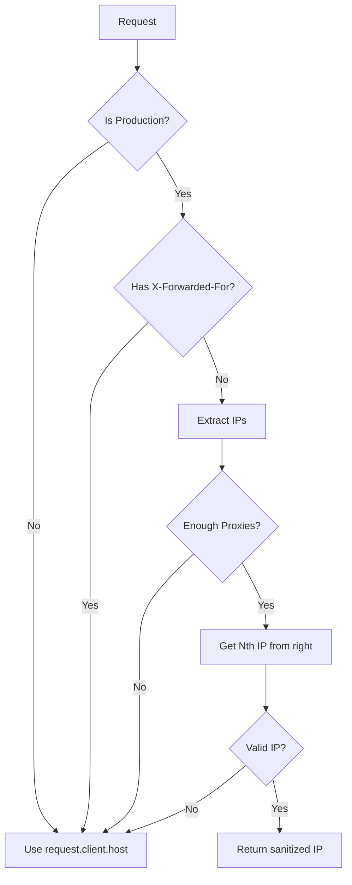

# Enterprise Security Hardening Plan - auth.py

## Executive Summary

This plan addresses 11 critical security vulnerabilities in `resync/api/routes/core/auth.py`. Based on code analysis, several fixes are **already partially implemented** and need improvement rather than new implementation.

---

## Current State Analysis

| Vulnerability | CWE | Current Status | Required Action |
|--------------|-----|----------------|-----------------|
| IP Spoofing | CWE-346 | ❌ Not implemented | Create `ip_utils.py` |
| Redis Lua Injection | CWE-943 | ⚠️ Partial (no IP sanitization) | Add `_sanitize_ip_for_redis_key()` |
| CSRF Protection | CWE-352 | ❌ Not implemented | Add SameSite cookies |
| JWT Token Leakage | CWE-532 | ⚠️ Partial (no token in traceback) | Add specific exception handling + log filter |
| Timing Attack | CWE-208 | ⚠️ Implemented but wrong (random delay) | Change to constant 50ms delay |
| Account Enumeration | CWE-204 | ⚠️ Partial (different messages) | Standardize to "Invalid credentials" |
| Password Hash Key Derivation | CWE-916 | ❌ Not implemented (uses JWT secret directly) | Implement HKDF |
| TOCTOU Race Condition | CWE-367 | ✅ Implemented (Lua atomic) | Verify and improve |
| Type Safety | - | ❌ Has `# mypy: no-rerun` skips | Remove and fix types |
| Fail-Closed Config | - | ⚠️ Partial (in get_jwt_secret_key) | Add startup validation |
| Thread-Safe Singleton | CWE-543 | ❌ Uses asyncio.Lock | Change to threading.Lock |

---

## PHASE 1: Setup & Infrastructure

### TASK-001: Environment Setup
**Status**: Assume dependencies already installed (project uses them)

### TASK-002: Dependency Updates
**Status**: Check existing dependencies

---

## PHASE 2: P0 Critical Vulnerabilities

### TASK-003: IP Spoofing Protection (CWE-346)
**File**: `resync/api/routes/core/ip_utils.py` (new)



**Implementation**:
1. Create `ip_utils.py` with `get_trusted_client_ip(request)` function
2. Add `trusted_proxy_count` to settings
3. Update `login()` endpoint to use new function

---

### TASK-004: Redis Lua Injection Fix (CWE-943)
**File**: `resync/api/routes/core/auth.py`

**Current Issue**: Line 273 uses raw IP as Redis key without sanitization
```python
# CURRENT (vulnerable):
key = f"{self._redis_prefix}:{ip}"
```

**Fix**: Add IP sanitization method:
```python
def _sanitize_ip_for_redis_key(self, ip: str) -> str:
    """Sanitize IP for Redis key - validates IPv4/IPv6 or hashes."""
    try:
        import ipaddress
        ipaddress.ip_address(ip)
        return ip
    except ValueError:
        # Invalid IP → hash it
        return hashlib.sha256(ip.encode()).hexdigest()[:16]
```

---

### TASK-005: CSRF Protection - SameSite Cookies (CWE-352)
**Files**: 
- `resync/api/routes/core/auth.py` (login/logout endpoints)
- `resync/settings.py` (cookie config)

**Changes**:
1. Login endpoint: Set cookie with `SameSite=Strict`
2. Logout endpoint: Clear cookie with matching `SameSite`
3. Add settings: `cookie_domain`, `cookie_samesite`

**Code**:
```python
# In login():
response.set_cookie(
    key="access_token",
    value=access_token,
    httponly=True,
    secure=settings.is_production,
    samesite="strict",  # CSRF protection
    max_age=ACCESS_TOKEN_EXPIRE_MINUTES * 60,
    path="/",
)
```

---

### TASK-006: JWT Token Leakage Prevention (CWE-532)
**Files**:
- `resync/api/routes/core/auth.py` (exception handling)
- `resync/core/structured_logger.py` (log filter)

**Changes**:
1. Add specific JWT exception handling in `verify_admin_credentials()`
2. Add `TokenSanitizingFilter` to structured logger

**Code**:
```python
# In verify_admin_credentials():
from jwt.exceptions import ExpiredSignatureError, InvalidTokenError

try:
    payload = jwt_security.decode_access_token(token)
    # ...
except ExpiredSignatureError:
    logger.info("token_expired", extra={"token_prefix": token[:8] + "..."})
except InvalidTokenError as e:
    logger.warning("token_invalid", extra={"error_type": type(e).__name__})
```

---

### TASK-007: Timing Attack Mitigation (CWE-208)
**File**: `resync/api/routes/core/auth.py`

**Current Issue**: Line 182 uses random delay
```python
# CURRENT (vulnerable to timing analysis):
await asyncio.sleep(secrets.randbelow(100) / 1000)  # 0-100ms random
```

**Fix**: Use constant delay
```python
# FIXED:
await asyncio.sleep(0.050)  # Constant 50ms
```

**Also**: Add constant delay in `verify_admin_credentials()`

---

### TASK-008: Account Enumeration Fix (CWE-204)
**File**: `resync/api/routes/core/auth.py`

**Current Issue**: Different error messages reveal account existence:
- Line 153: "Too many failed attempts. Try again in {remaining} minutes"
- Line 197: "Invalid credentials"

**Fix**: Use generic message for all failures
```python
GENERIC_AUTH_ERROR = "Invalid credentials"

# In verify_credentials():
if is_locked:
    return False, GENERIC_AUTH_ERROR  # Don't reveal lockout status

if not credentials_valid:
    return False, GENERIC_AUTH_ERROR  # Don't reveal if username exists
```

---

### TASK-009: Password Hash Key Derivation (CWE-916)
**File**: `resync/api/routes/core/auth.py`

**Current Issue**: Line 220 uses JWT secret directly
```python
# CURRENT (weak):
secret = _get_configured_secret_key() or get_jwt_secret_key()
```

**Fix**: Use HKDF to derive separate auth key
```python
from cryptography.hazmat.primitives import hashes
from cryptography.hazmat.primitives.kdf.hkdf import HKDF

def _get_auth_key(self) -> bytes:
    """Derive authentication key from JWT secret using HKDF."""
    jwt_secret = _get_configured_secret_key() or get_jwt_secret_key()
    
    hkdf = HKDF(
        algorithm=hashes.SHA256(),
        length=32,
        salt=b"resync-auth-credential-hashing-v1",
        info=b"credential-verification",
    )
    return hkdf.derive(jwt_secret.encode("utf-8"))
```

---

## PHASE 3: P1 High Priority

### TASK-010: TOCTOU Race Condition (CWE-367)
**Status**: ✅ Already implemented (Lua atomic script)

**Verification**: Ensure the Lua script at lines 279-314 is correct and handles all edge cases.

---

### TASK-011: Type Safety Restoration
**File**: `resync/api/routes/core/auth.py`

**Changes**:
1. Remove lines 1-2 (pylint disable, mypy no-rerun)
2. Fix type annotations:
   - `_authenticator: SecureAuthenticator | None = None`
   - Return types for all functions

---

### TASK-012: Fail-Closed Configuration
**File**: `resync/api/routes/core/auth.py`

**Current**: Partial implementation in `get_jwt_secret_key()` (lines 98-107)

**Enhancement**: Add `validate_auth_configuration()` function called at startup

---

### TASK-013: Thread-Safe Singleton (CWE-543)
**File**: `resync/api/routes/core/auth.py`

**Current Issue**: Lines 347, 360 use `asyncio.Lock`
```python
# CURRENT (wrong for multi-loop):
_authenticator_init_lock: "asyncio.Lock | None" = None
_authenticator_init_lock = asyncio.Lock()
```

**Fix**: Use `threading.Lock`
```python
import threading

_authenticator_init_lock = threading.Lock()

# In get_authenticator():
with _authenticator_init_lock:
    if _authenticator is None:
        _authenticator = SecureAuthenticator()
```

---

## Implementation Order

```mermaid
gantt
    title Security Hardening Timeline
    dateFormat  X
    axisFormat %sh
    
    section Phase 1
    Setup Dependencies      :0, 1
    
    section Phase 2 (P0)
    IP Spoofing             :1, 2
    Redis Injection         :2, 3
    CSRF Protection         :3, 4
    Token Leakage           :4, 5
    Timing Attack           :5, 6
    Account Enum            :6, 7
    Key Derivation          :7, 8
    
    section Phase 3 (P1)
    TOCTOU Verification     :8, 9
    Type Safety             :9, 10
    Fail-Closed            :10, 11
    Thread-Safe Singleton  :11, 12
```



---

## Files to Modify

| File | Changes |
|------|---------|
| `resync/api/routes/core/auth.py` | Main changes (all tasks except IP spoofing) |
| `resync/api/routes/core/ip_utils.py` | New file for IP utilities |
| `resync/settings.py` | Add cookie and proxy settings |
| `resync/core/structured_logger.py` | Add token sanitizing filter |

---

## Testing Strategy

| Test File | Coverage |
|-----------|----------|
| `tests/test_ip_spoofing.py` | IP spoofing attacks |
| `tests/test_redis_injection.py` | Lua injection attempts |
| `tests/test_csrf_protection.py` | CSRF attack prevention |
| `tests/test_token_leakage.py` | Token not in logs |
| `tests/test_timing_attacks.py` | Constant timing |
| `tests/test_account_enumeration.py` | Generic error messages |
| `tests/test_key_derivation.py` | HKDF implementation |
| `tests/test_singleton_thread_safety.py` | Multi-event-loop |

---

## Definition of Done

For each task:
- [ ] Code implemented
- [ ] Tests added and passing
- [ ] Type checking passes (mypy --strict)
- [ ] Security linter passes (bandit)

For project:
- [ ] All 11 vulnerabilities addressed
- [ ] No new security issues introduced
- [ ] Code review approved
