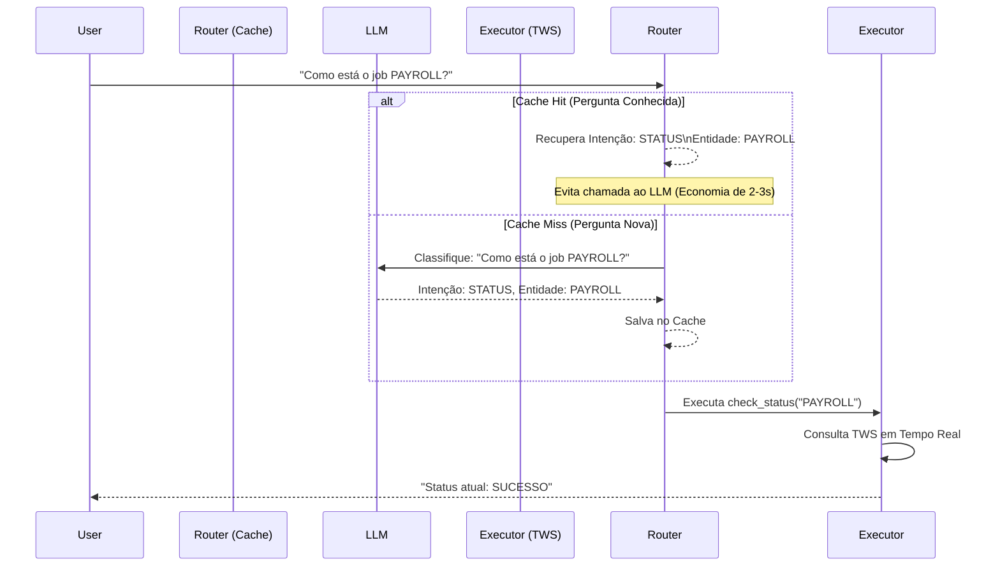

# Implementação de Cache Semântico de Intenção no Resync 6.0

## 1. O Problema: Cache em Sistemas de Tempo Real
Em operações críticas como o **Tivoli Workload Scheduler (TWS)**, a informação deve ser **fresca**. Um cache tradicional de resposta completa é perigoso:

> **Cenário de Risco:**
> 1. Usuário: "O Job X falhou?" -> Sistema: "Sim" (Cacheia a resposta)
> 2. Operador corrige o Job X.
> 3. Usuário: "O Job X falhou?" -> Cache: "Sim" (Informação incorreta!)

## 2. A Solução: Cache de Intenção (Router Caching)
Ao invés de cachear a **resposta final** (o estado do job), cacheamos apenas a **compreensão da pergunta** (a intenção e as entidades).

O fluxo otimizado garante eficiência sem sacrificar a precisão dos dados:



---

## 3. Implementação Detalhada

### Passo 1: Ajustar o `SemanticCache` para Suportar Payloads JSON

O arquivo `resync/core/cache/semantic_cache.py` já usa RedisVL. Precisamos garantir que ele possa armazenar e recuperar o objeto `RouterOutput` serializado.

**Arquivo:** `resync/core/cache/semantic_cache.py`

```python
# ... imports ...

class SemanticCache:
    # ... (métodos existentes) ...

    async def check(self, query_text: str) -> Optional[Dict[str, Any]]:
        """
        Verifica se a pergunta já existe no cache semântico.
        Retorna o payload (Intenção + Entidades) se encontrar similaridade > threshold.
        """
        if not self._initialized:
            await self._initialize()

        # Gera embedding da pergunta atual
        query_embedding = await generate_embedding(query_text)

        # Busca vetorial no Redis
        results = await self.index.query(
            VectorQuery(
                vector=query_embedding,
                vector_field_name="embedding",
                return_fields=["response", "metadata", "score"],
                num_results=1
            )
        )

        if not results:
            return None

        best_match = results[0]
        score = float(best_match.get("score", 0))

        # Verifica se a similaridade atinge o limiar (ex: 0.9)
        if score < self.threshold:
            return None

        # O campo 'response' no Redis armazena nosso JSON de intenção
        try:
            cached_data = json.loads(best_match["response"])
            return cached_data
        except json.JSONDecodeError:
            logger.error("Falha ao decodificar cache semântico", extra={"data": best_match["response"]})
            return None

    async def store(self, query_text: str, intent_data: Dict[str, Any]):
        """
        Armazena a compreensão da pergunta no cache.
        intent_data deve ser o dicionário do RouterOutput (intent, entities, confidence).
        """
        if not self._initialized:
            await self._initialize()

        embedding = await generate_embedding(query_text)
        
        # Serializa o objeto de intenção para salvar no campo 'response'
        payload_json = json.dumps(intent_data)

        # Salva no RedisVL
        await self.index.load([{
            "query_text": query_text,
            "embedding": embedding,
            "response": payload_json,  # AQUI ESTÁ O TRUQUE: Salvamos a INTENÇÃO, não a resposta final
            "timestamp": time.time(),
            "metadata": json.dumps({"type": "router_cache"})
        }])
```

### Passo 2: Integrar no `router_node` do `agent_graph.py`

Agora modificamos o nó de roteamento para consultar o cache antes de chamar o LLM.

**Arquivo:** `resync/core/langgraph/agent_graph.py`

```python
# Adicionar imports
from resync.core.cache.semantic_cache import SemanticCache
from resync.core.langgraph.models import RouterOutput, Intent

# Instância global ou injetada (Recomendado Singleton)
# cache_threshold=0.95 garante que só perguntas MUITO parecidas usem o cache
router_cache = SemanticCache(threshold=0.95, default_ttl=3600) 

async def router_node(state: AgentState) -> AgentState:
    """
    Classifica a intenção usando Cache Semântico (Rápido) ou LLM (Lento).
    """
    message = state.get("message", "")
    
    # --- LÓGICA DE HARDENING (Mantém o reset de estado transiente) ---
    transient_defaults = { ... } # (Código existente de reset)
    for k, default in transient_defaults.items():
        state[k] = default

    # --- NOVO: TENTATIVA DE CACHE ---
    try:
        # Busca no cache se já entendemos essa pergunta antes
        cached_intent = await router_cache.check(message)
        
        if cached_intent:
            logger.info("⚡ Router Cache Hit", extra={"intent": cached_intent.get("intent")})
            
            # Popula o estado com a compreensão recuperada
            state["intent"] = Intent(cached_intent["intent"])
            state["entities"] = cached_intent.get("entities", {})
            state["confidence"] = 1.0  # Confiança total pois já foi validado antes
            state["current_node"] = "router"
            
            # Retorna imediatamente, pulando o LLM
            return state
            
    except Exception as e:
        logger.warning("Erro ao consultar Router Cache", error=str(e))
        # Falha silenciosa: continua para o LLM

    # --- LÓGICA EXISTENTE (LLM) ---
    # ... (código original que chama call_llm_structured) ...
    
    # Se o LLM retornar sucesso, salvamos no cache para a próxima vez
    if result:
        state["intent"] = result.intent
        state["confidence"] = result.confidence
        state["entities"] = result.entities
        
        # --- NOVO: SALVAR NO CACHE ---
        # Só cacheamos se a confiança for alta (> 0.8) para não propagar erros
        if result.confidence > 0.8:
            try:
                await router_cache.store(message, {
                    "intent": result.intent.value,
                    "entities": result.entities,
                    "confidence": result.confidence
                })
            except Exception as e:
                logger.warning("Erro ao salvar no Router Cache", error=str(e))

    return state
```

### Passo 3: Garantir que o Executor SEMPRE consulte a Fonte Real

Os nós subsequentes (`planner`, `tool_executor`) não precisam de alteração, pois eles operam baseados no `state["intent"]` e `state["entities"]`.

Se o `intent` for `STATUS` e a entidade for `PAYROLL`, o executor vai rodar o comando TWS naquele momento.

**Exemplo de Fluxo Seguro:**

1.  **Cache:** Diz que "Status do Payroll" -> `Intent: STATUS`, `Entity: PAYROLL`.
2.  **Planner:** Recebe `STATUS` + `PAYROLL`. Gera plano: `check_job_status("PAYROLL")`.
3.  **Executor:** Roda `conman sj PAYROLL`.
    *   *Se o job mudou de status há 1 segundo, o comando `conman` vai pegar o status novo.*
    *   O Cache de Intenção não interfere na frescura do dado.

## 4. Benefícios Esperados

| Métrica | Sem Cache | Com Router Cache |
| :--- | :--- | :--- |
| **Latência de Resposta** | 3.0s - 5.0s | **0.5s - 1.0s** (para perguntas frequentes) |
| **Custo de LLM** | Alto (1 call por mensagem) | **Reduzido** (apenas perguntas novas) |
| **Consistência** | Varia (LLM pode mudar opinião) | **Alta** (Mesma pergunta = Mesma interpretação) |
| **Frescura dos Dados** | Tempo Real | **Tempo Real** (Garantido pelo Executor) |

## 5. Próximos Passos (To-Do)

1.  [ ] **Atualizar `SemanticCache`**: Garantir suporte a serialização JSON no campo `response`.
2.  [ ] **Instrumentar `router_node`**: Adicionar a lógica de `check()` e `store()`.
3.  [ ] **Testes de Regressão**: Verificar se perguntas ambíguas não estão sendo cacheadas incorretamente (ajustar `threshold` se necessário).
4.  [ ] **Monitoramento (Dashboard Nativo)**: 
    - Como o projeto não usa Grafana, devemos atualizar o `dashboard.py` para coletar métricas do `SemanticCache`.
    - Adicionar card "Router Cache Hits" no `metrics_dashboard.html`.
